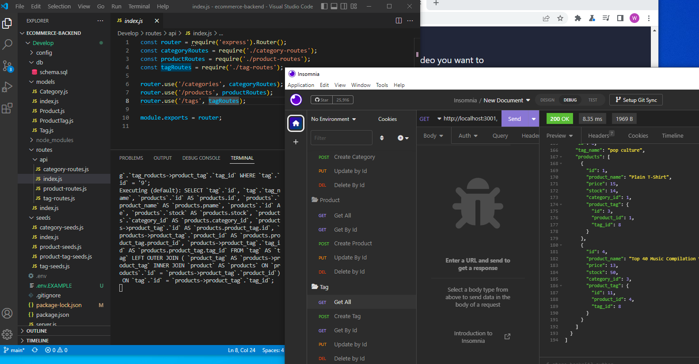

# ecommerce-backend
back end solution for am ecommerce site
Hello! This repository contains the code I created for the
E-commerce back end.
I utilized Sequelize and RESTful API's to build this solution,
and I used Insomnia to test the routes.

Here is the link to the repository:
https://github.com/whitspa/ecommerce-backend.git

And here is the link to Category,Product, and Tag routes being
tested with Insomnia:
https://drive.google.com/file/d/1HJWA0CPuimX5YkDmwSOd1gUO8atoXjPI/view

My github repository is published under the MIT license
and I can be reached via email at: whitspa64@gmail.com
with any questions.

A screen shot of the application from the API routes index.js file next to the insomnia route testing screen is below:

